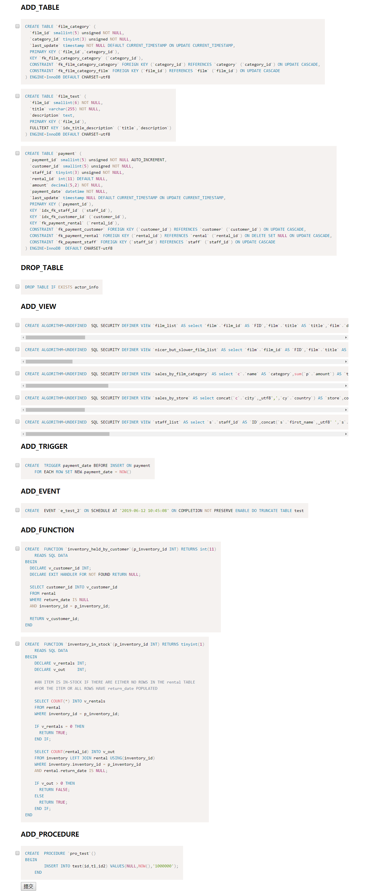

# mysql-struct-sync
可用于帮助开发人员比较两个数据库之间的差异(表,列,约束,事件,函数,存储过程,触发器,视图),并生成更新语句。 
Can be used to synchronize database structures, compare differences(table,column,constraints,events,functions,procedures,triggers,views) between databases and generating queries.


### TODOs 功能
- [X] Handle Create Tables
- [X] Handle Alter Tables
- [X] Handle Drop table Queries
- [X] Handle constraints (PK,FK,index, ... etc)
- [X] Handle events
- [X] Handle functions
- [X] Handle procedures
- [X] Handle triggers
- [X] Handle views


### Installation 安装方式

to install this library using composer:
```sh
composer require 9raxdev/mysql-struct-sync
```


### Attention 注意
1.无法识别rename字段,更改数据库字段名称在代码中的体现为:先删除命名前的字段,再增加命名后的字段。The rename field is not recognized. Changing the database field name in the code is as follows: first delete the field before the name, and then add the named field.

2.```advanceDiff()```必须基于```baseDiff()```前提下,因为储存过程,触发器,函数等特性都依赖数据表。```advanceDiff()``` must be based on ```baseDiff()```, because procedures, triggers, functions, etc. depend on the tables.

### Demo
```php
<?php

include __DIR__.'/MysqlStructSync.php'; 

 
$local_database_config=['host'=>'127.0.0.1','username'=>'root','passwd'=>'root','dbname'=>'test','port'=>3306];

$develop_database_config=['host'=>'127.0.0.1','username'=>'root','passwd'=>'root','dbname'=>'sakila','port'=>3306];

//把local数据库结构更新为develop数据库结构
$compare=new \linge\MysqlStructSync($local_database_config,$develop_database_config);

$compare->removeAutoIncrement();

$compare->baseDiff(); //TABLE COLUMNS(ADD,DROP,MODIFY) CONSTRAINTS(PK,FK,index, ... etc)

$compare->advanceDiff(); //VIEW TRIGGER EVENT FUNCTION PROCEDURE (ADD,DROP)

$diff_sql=$compare->getDiffSql();
//print_r($diff_sql);

/*******************************************/
//用法一:自动执行全部差异语句,更新结构
//$execute_sql_stat=$compare->execute();
//print_r($execute_sql_stat);


//用法二:手动选择要执行的差异语句,记住:选择储存过程，函数等请确保数据库表已经同步
$compare->manuallySelectUpdates();
```
